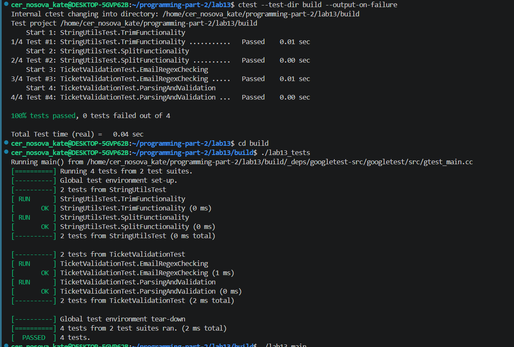
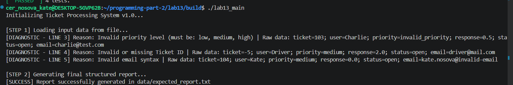
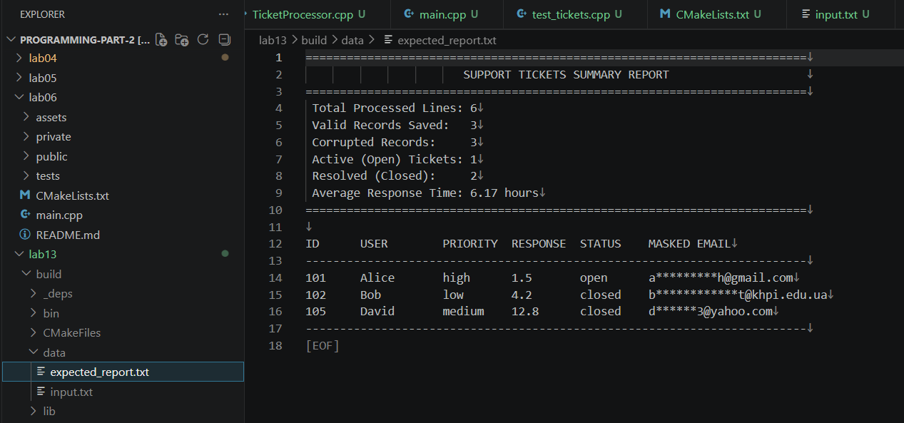

# Lab 13 - Lab Work Report Template

---
**Course:** Programming, Part 2
**Institution:** NTU KhPI, Kharkiv, Ukraine  
**Student:** _Nosova_Kate_  
**Date:** _08_06_26

---
# Task Description

The system must read raw data from an input text file (data/input.txt). Each line represents a single support ticket consisting of key=value pairs separated by semicolons (;).
---

## Structure

```text
lab13/
├── assets/
├── private/
    ├── Ticket.cpp
    ├── StringUtils.cpp
    |__ TicketProcessor.cpp
├── public/
    ├── Ticket.h
    ├── StringUtils.h
    |__ TicketProcessor.h
├── data/
    ├── expected_report.txt
    |__ input.txt
├── tets/
    |__ test_tickets.cpp
├── CMakeLists.txt
├── main.cpp
|__ README.md
```

# Lab Instructions

1) The project must be built as a coherent C++ project.
2) The code must be divided into logical modules: helper functions, record structure, parsing, report, main program, and tests.
3) The data/input.txt file must contain at least 15 lines, including at least 10 valid and at least 5 invalid or partially invalid lines.
4) For basic key=value parsing, use std::string, find(), substr(), trim(), and split().
5) For a high-level solution, approximately 90+ points, implement a zero-copy version of the helper functions based on std::string_view: trim_view(), split_view(), and parseKeyValueView(); in the report, explain the advantages of the approach and the risk of dangling std::string_view.
6) For numeric conversion, check errors and do not accept partially valid strings such as 24abc.
7) The file must be opened through std::ifstream with a check for successful opening; std::filesystem may be used for paths and directories.
8) Valid records must be stored in a container, and invalid lines must be stored in a diagnostic structure with the line number, original text, and error message.
9) The report must be generated through std::ostringstream and written through std::ofstream; std::format may be used as a modern alternative
for individual report rows if the environment supports it.
10) The program report must contain statistics, a table of selected records, and a list of invalid lines.
11) Use std::regex_match() or std::regex_search() for meaningful validation of a field according to the variant.
12) Use std::regex_replace() for masking or text normalization according to the variant.
13) Demonstrate the difference between the byte length of ASCII and UTF-8 strings.
14) Show a short example using c_str() and a fixed-size buffer through std::snprintf.
15) Explain why JSON or a similar structured format should not be parsed with regular expressions.
16) Check the operation of trim(), split(), parseKeyValue(), parseRecord(), report generation, regex validation, and regex replacement.

### How to Build
```bash
cd lab03 
cmake -S . -B build
cmake --build build
ctest --test-dir build --output-on-failure
```

### How to

```bash
cd build
./lab13_main
./lab13_tests
```
 
### Report

The goal of this lab is to develop practical skills in processing text, handling text files, and utilizing regular expressions in C++.

In this lab, I completed the following tasks:
Support tickets. Format: ticket=101; user=Alice; priority=high; response=4.5; status=open; email=alice@example.com. Compute the average response time, the number of open tickets, and the list of highpriority tickets. Validate ticket as an integer, response as a non-negative real number, priority as low/medium/high, and status as open/closed; validate or mask the email-like field using std::regex.

---

### Test Results



### Runtime Output




### Conclusion  

In this lab I learn how to develop practical skills in processing text, handling text files, and utilizing regular expressions in C++.

In my version of the program, I wrote code that efficiently parses support tickets using std::string_view, validates and masks user emails via regular expressions, and automatically generates a structured statistical report while logging precise diagnostics for corrupted data.